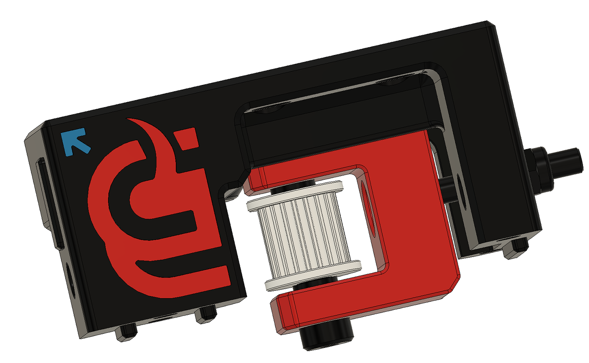

# Mammoth-3D Voron2.4 Z Idler @ Printables.com  

By choosing to pay a small fee ($5 - $10) for Mammoth-3D parts, end users contribute to the continuous development and innovation of Mammoth-3D’s 3D printing technology. 

## Mammoth-3D Voron2.4 Z Idler Installation Guide

  

## How to print

### Slicer Settings

- Layer hight: 0.2mm
- Wall loops: 4
- Top shell layers: 5
- Bottom shell layers: 5
- Sparse infill density: 42%
- Sparse infill pattern: Grid
- Enable support: No
- Filament: ABS, ASA, PA-CF

### Parts to print

- 2 x Mammoth-3D Voron2.4 Z Idler_V1.3 Cover Body Left
- 2 x Mammoth-3D Voron2.4 Z Idler_V1.3 Main Body Left
- 2 x Mammoth-3D Voron2.4 Z Idler_V1.3 Cover Body Right
- 2 x Mammoth-3D Voron2.4 Z Idler_V1.3 Main Body Right
- 4 x Mammoth-3D Voron2.4 Z Idler_V1.3 U
- 4 x Mammoth-3D Voron2.4 Z Idler_V1.3 Tensioner

### How to print

  

### BOM Version 1.3

| Quantity | Description | Link |
| --- | --- | --- |
| 16x | M3 Voron Threaded Inserts | [Link](https://www.3djake.com/ruthex/threaded-insert-m3-voron-100-pieces) |
| 16x | M3 SHCS 25mm Screw | |
| 4x | M4 Washer 9x4x1mm | |
| 12x | M4 Lock Nut | |
| 4x | M4 Countersunk Screws 30mm | |
| 24x | M5 5x7x1mm Shim | [Link](https://www.eurorc.com/product/33229/xray-alu-shim-5x7x10mm-10) |
| 8x | M5 BHCS 10mm Scre | |
| 4x | M5 BHCS 30mm Scre | |
| 4x | Sholder bolt 25mm: Shoulder Diameter (d) 5mm / Thread Size 4mm   | [Link](https://www.aliexpress.com/item/1005006421378844.html?spm=a2g0o.productlist.main.71.27ff48e6Frsjo5&algo_pvid=d11ee3a7-9eb6-4500-9996-a2e7efabc892&aem_p4p_detail=202406150815372788240971360240003529643&algo_exp_id=d11ee3a7-9eb6-4500-9996-a2e7efabc892-35&pdp_npi=4%40dis%21CHF%213.41%212.39%21%21%213.74%212.62%21%402103252e17184645377636619e09ba%2112000037104506821%21sea%21CH%21169545247%21&curPageLogUid=NHDO4C1VleMM&utparam-url=scene%3Asearch%7Cquery_from%3A&search_p4p_id=202406150815372788240971360240003529643_9) |
| 8x | Sholder bolt 30mm: Shoulder Diameter (d) 5mm / Thread Size 4mm | [Link](https://www.aliexpress.com/item/1005006421378844.html?spm=a2g0o.productlist.main.71.27ff48e6Frsjo5&algo_pvid=d11ee3a7-9eb6-4500-9996-a2e7efabc892&aem_p4p_detail=202406150815372788240971360240003529643&algo_exp_id=d11ee3a7-9eb6-4500-9996-a2e7efabc892-35&pdp_npi=4%40dis%21CHF%213.41%212.39%21%21%213.74%212.62%21%402103252e17184645377636619e09ba%2112000037104506821%21sea%21CH%21169545247%21&curPageLogUid=NHDO4C1VleMM&utparam-url=scene%3Asearch%7Cquery_from%3A&search_p4p_id=202406150815372788240971360240003529643_9) |
| 4x | Mellow Pulleys 14/11 Smooth Wheel Bore 5mm GT2 | [Link](https://www.aliexpress.com/item/33023133633.html?spm=a2g0o.order_list.order_list_main.106.466a1802OX6ZxT) |
| 8x | Mellow Pulleys 14/11 20 Tooth Wheel Bore 5mm GT2 | [Link](https://www.aliexpress.com/item/33023133633.html?spm=a2g0o.order_list.order_list_main.106.466a1802OX6ZxT) |
| 4x | POWGE GT2 LL-2GT E 2GT (9mm wide) | [Link](https://www.aliexpress.com/item/1005002809830788.html?spm=a2g0o.detail.pcDetailTopMoreOtherSeller.6.79d0YB5UYB5URT&gps-id=pcDetailTopMoreOtherSeller&scm=1007.40050.354490.0&scm_id=1007.40050.354490.0&scm-url=1007.40050.354490.0&pvid=081e1067-8d34-426a-abbb-7cfa7bff0aea&_t=gps-id:pcDetailTopMoreOtherSeller,scm-url:1007.40050.354490.0,pvid:081e1067-8d34-426a-abbb-7cfa7bff0aea,tpp_buckets:668%232846%238116%232002&pdp_npi=4%40dis%21CHF%2137.30%2135.44%21%21%2141.03%2138.98%21%402103011017189552476844442ea66f%2112000022296348281%21rec%21CH%21169545247%21&utparam-url=scene%3ApcDetailTopMoreOtherSeller%7Cquery_from%3A) |

### Preassembly

- Insert a M4 lock nut into the U Pic and screw in the M4 30mm countersunk screw 3/4 of the way.

  

- Repeat the same step for all 4x U prices.

- Take 4x threaded inserts and install them into the Cover Body (short body).

  

- Repeat the same step for all 4x Cover Bodys.

### Assembly

- Take one of the Main Bodys and insert the U Pic assembly. The fat side fits into the Main Body.

  

- Now screw in the countersunk screws all the way and add 1x M4 washer 9x4x1mm and 1x M4 lock nut on the outside of the Main Body.

  

- Insert a M4 lock nut into the U Pic, take one 25mm sholder bolt and insert it into the U Pic. In the inside you should have a M5 5x7x1mm Shim - Mellow Pulleys 14/11 20 Tooth Wheel Bore 5mm GT2 - M5 5x7x1mm Shim. Screw the sholder bolt into the lock nut and check that the pulley can move freely.

   | 

- Insert 2x 30mm Sholder bolt into the Main Body.

  

- Install 2x M5 5x7x1mm shims, one on each sholder bolt.

  

- Install 1x Mellow Pulleys 14/11 20 Tooth Wheel Bore 5mm GT2 on the outside and 1x Mellow Pulleys 14/11 Smooth Wheel Bore 5mm GT2 in the inside.

  

- Install 2x M5 5x7x1mm shims, one on each sholder bolt.

  

- Take the matching Cover Body and screw the sholder bolts into the Cover Body till they start threading into the 3D printed part. Dont screw it in all the way!!

  

- Take 4x M3 SHCS 25mm screws and install them into the Mail Body.

  

- Now screw in the sholder bolts. Don't over tighten them!! And check that the pulleys can move freely.

- Repeat the same step for all 4x Main Bodys.

### Get your Printer ready for the Mammoth-3D Voron2.4 Z Idler Installation.

- Move you gantry all the way down or secure it that it will not drop when removing the Z belts!

- Once the gantry is secure, remove your stock Z Idlers and belts. You will need new belts, as the once installed are not long enough.

  

<iframe src="https://logwork.com/countdown-ft3u" allowTransparency="true" frameborder="0" ></iframe>
